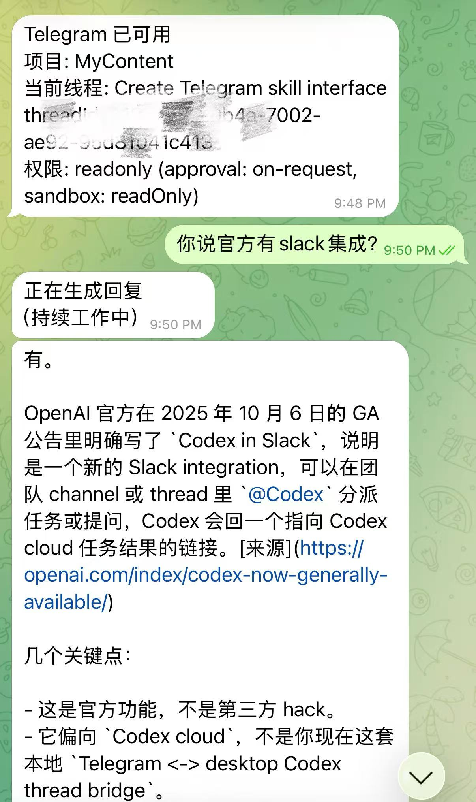
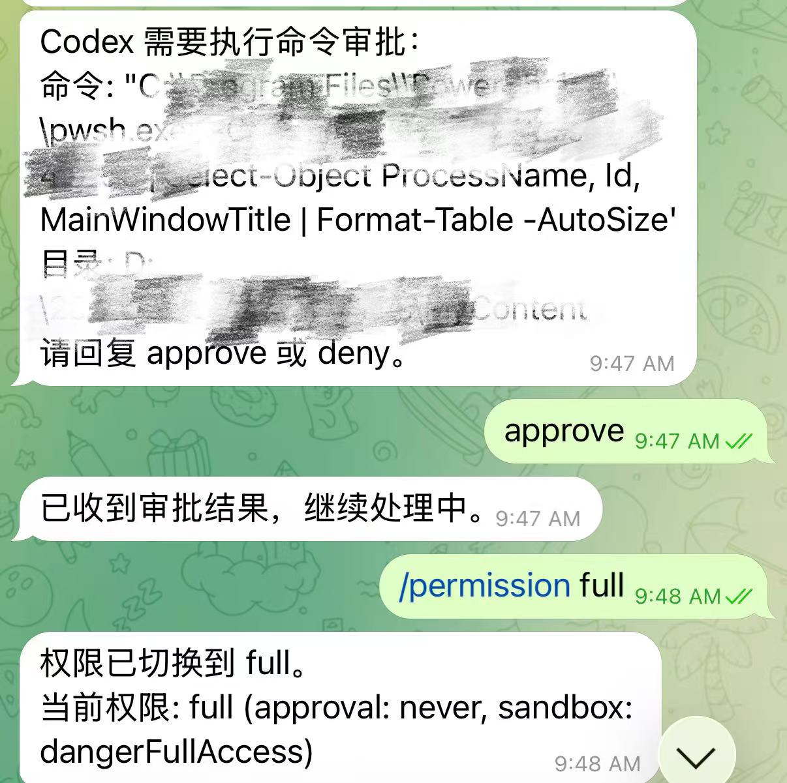

# Codex Chat Bridge

## 简介

把一个正在运行的 Codex thread 桥接到外部聊天应用里，同时保持 Codex 侧还是同一个 `threadId` 和同一份历史。

当前这个仓库提供的是一个偏生产可用的 Telegram 适配器（其他聊天应用比如WhatsApp会之后加入），包括：

- 本地 bridge daemon
- 一个显式 handoff 的 Codex skill
- 运行期间出现的 tray / menu-bar helper
- Telegram 侧的进度、审批、提问与权限切换

仓库名故意比 Telegram 更泛化，因为后续架构可以继续扩展到其他聊天入口。

## Introduction

Bridge a live Codex thread into an external chat app while keeping the same `threadId` and history on the Codex side.

Today this repo ships a production-leaning Telegram adapter with:

- a local bridge daemon
- a Codex skill for explicit handoff
- a tray or menu-bar helper while the bridge is running
- progress updates, approvals, questions, and permission switching from Telegram

The repository name is broader than Telegram on purpose because the architecture can later grow into additional chat adapters.

## 它能做什么




当你在某个 Codex thread 里显式调用已安装的 `telegram-handoff` skill 时，bridge 会：

- 把当前 Telegram chat 绑定到当前 Codex thread
- 把 Telegram 文本继续 relay 到这个同一个 thread
- 把中间进度和最终回复发回 Telegram
- 在 Telegram 里处理审批、追问和权限切换
- 你可以随时 detach，回到 Codex

它是 local-first 的：

- 主要执行仍然发生在你本机
- Codex thread 仍然是桌面端那条真实 thread
- Telegram 只是这个 thread 的外部入口

### 一个典型场景

比如你正让 Codex 在电脑上持续开发，但你临时要出门买菜、去健身、或者离开电脑一阵子。这时候你不需要中断当前工作，只要让 Codex 使用 `telegram-handoff` skill，把当前 thread bridge 到 Telegram 上。

之后你就可以直接在 Telegram bot 里继续推动这条 thread：

- 发普通文字继续任务
- 看中间进度
- 处理审批或追问
- 用手机输入法语音输入，也很方便

当你回到电脑前，所有手机上的记录也会在同一个thread里，你可以无缝继续（推荐操作是先在tg上发“detach”或者从电脑端任务托盘上把bridge关掉）。注意codex app不会实时显示这条thread在telegram上的历史记录，但是你只要重启codex app，就可以看见完整的历史记录。不重启也可以继续使用，codex内部依然记得telegram上的全部会话。

每次桥接都可以是不同的 Codex thread，但都桥接到同一个 Telegram bot 上，不需要为不同项目额外注册多个 bot。

## What It Does

When you explicitly invoke the installed `telegram-handoff` skill inside a Codex thread, the bridge:

- binds that Telegram chat to the current Codex thread
- relays Telegram text into the same thread
- returns progress updates and final replies back to Telegram
- supports approvals, follow-up questions, and permission switching in Telegram
- lets you detach and return to Codex

It is local-first:

- primary execution still happens on your machine
- the Codex thread remains the real desktop thread
- Telegram acts as an external entrypoint into that same thread

### A Typical Scenario

Imagine Codex is actively working on your computer, but you need to step away for groceries, a workout, or any short errand. Instead of stopping the work, you ask Codex to use the `telegram-handoff` skill and bridge the current thread to Telegram.

From there, you can keep pushing the same thread from the Telegram bot:

- send normal text messages
- monitor intermediate progress
- handle approvals or follow-up questions
- even use mobile voice input for convenience

When you return to your computer, all the records from your mobile device will appear within the same thread, allowing you to continue seamlessly (the recommended procedure is to first send "detach" via Telegram, or to close the bridge from the system tray on your computer). Please note that the Codex app does not display the history of this thread from Telegram in real-time; however, simply restarting the app will allow you to view the complete history. You can continue using the app without restarting, as Codex internally retains the full record of all conversations from Telegram.

Each handoff can point to a different Codex thread, while still using the same Telegram bot. You do not need to register multiple bots for different projects.

## 当前范围

当前适配器：

- Telegram

当前能力：

- 同一个 thread 从 Codex 切到 Telegram
- queueing 和进度更新
- `/help`
- `/status`
- `/changes`
- `/last-error`
- `/cancel`
- `/detach`
- `/permission`，并带 `default`、`readonly`、`workspace`、`full` 的 inline chooser
- bridge 运行期间的 tray / menu-bar companion
- bridge 干净退出时自动清理 active binding

## Current Scope

Current adapter:

- Telegram

Current capabilities:

- same-thread handoff from Codex to Telegram
- queueing and progress updates
- `/help`
- `/status`
- `/changes`
- `/last-error`
- `/cancel`
- `/detach`
- `/permission` with an inline chooser for `default`, `readonly`, `workspace`, and `full`
- a temporary tray or menu-bar companion while the bridge is running
- active bindings are cleared automatically when the bridge exits cleanly

## 依赖

必需：

- Codex Desktop，或任何支持 `codex app-server` 的 Codex 环境
- `PATH` 中可用的 Node.js
- Telegram 账号
- 通过 BotFather 创建的 Telegram bot

推荐：

- `PATH` 中可用的 Rust 和 Cargo

推荐原因：

- tray helper 是用 Rust 实现的
- 如果 `~/.codex/telegram-bridge/tray-companion/target/release` 下没有预编译 tray binary，bridge 会自动回退到 `cargo run`

## Prerequisites

Required:

- Codex Desktop, or a Codex environment that supports `codex app-server`
- Node.js on `PATH`
- a Telegram account
- a Telegram bot created with BotFather

Recommended:

- Rust and Cargo on `PATH`

Why Rust is recommended:

- the tray helper is implemented in Rust
- if no prebuilt tray binary exists in `~/.codex/telegram-bridge/tray-companion/target/release`, the bridge falls back to `cargo run`

## 安装

这个仓库推荐安装到你的 Codex home，而不是安装到某个业务代码库里。

推荐目标路径：

- bridge: `~/.codex/telegram-bridge`
- skill: `~/.codex/skills/telegram-handoff`

如果你想覆盖安装位置，可以在运行安装器前设置 `CODEX_HOME`。

### Windows PowerShell

在仓库根目录执行：

```powershell
& .\install.ps1
```

### macOS / POSIX shell

在仓库根目录执行：

```sh
./install.sh
```

安装器会：

- 把 bridge 复制到 `~/.codex/telegram-bridge`
- 把 skill 复制到 `~/.codex/skills/telegram-handoff`
- 首次安装时从 `config.example.json` 创建 `config.json`

## Install

This repo is designed to install into your Codex home rather than into one of your app repos.

Recommended target paths:

- bridge: `~/.codex/telegram-bridge`
- skill: `~/.codex/skills/telegram-handoff`

If you want to override the destination, set `CODEX_HOME` before running the installer.

### Windows PowerShell

From the repo root:

```powershell
& .\install.ps1
```

### macOS / POSIX shell

From the repo root:

```sh
./install.sh
```

The installer:

- copies the bridge into `~/.codex/telegram-bridge`
- copies the skill into `~/.codex/skills/telegram-handoff`
- creates `config.json` from `config.example.json` on first install

## 快速配置

### 1. 创建 Telegram bot

在 Telegram 里：

1. 打开 [@BotFather](https://t.me/BotFather)
2. 发送 `/newbot`
3. 设置 bot 名字
4. 设置一个以 `bot` 结尾的唯一用户名
5. 保存 BotFather 返回的 bot token

### 2. 和 bot 建立聊天

打开 bot 对话，然后：

1. 点击 `Start`
2. 至少发送一条普通消息，比如 `hello`

### 3. 找到你的 Telegram chat id，用于 allowlist

推荐方式 A：

使用 Bot API 的 `getUpdates`：

```text
https://api.telegram.org/bot<YOUR_BOT_TOKEN>/getUpdates
```

在返回结果里找到：

```json
message.chat.id
```

对于你和自己 bot 的私聊，这个值就可以作为 allowlisted chat id。

备选方式 B：

你也可以使用一个 Telegram user-id / id lookup bot 查询自己的 user id。对私聊 bot 的场景来说，它通常和你需要的 private chat id 一致。

### 4. 填写 bridge 配置

编辑：

`~/.codex/telegram-bridge/config.json`

填写：

- `telegramBotToken`
- `allowedChatIds`
- `defaultChatId`

示例：

```json
{
  "_notes": [
    "The bridge auto-starts a temporary tray or menu-bar companion while a thread is attached.",
    "If no release tray binary is built, the launcher falls back to cargo run, so Rust and Cargo must be available on PATH."
  ],
  "telegramBotToken": "123456789:AA...",
  "allowedChatIds": ["123456789"],
  "defaultChatId": "123456789",
  "pollIntervalMs": 5000,
  "controlPort": 47821
}
```

## Quick Setup

### 1. Create a Telegram bot

In Telegram:

1. Open [@BotFather](https://t.me/BotFather)
2. Send `/newbot`
3. Choose a display name
4. Choose a unique bot username ending in `bot`
5. Copy the bot token returned by BotFather

### 2. Start a chat with your bot

Open the bot chat and:

1. Press `Start`
2. Send at least one normal message like `hello`

### 3. Find your Telegram chat id for the allowlist

Option A, recommended:

Use the Bot API `getUpdates` endpoint:

```text
https://api.telegram.org/bot<YOUR_BOT_TOKEN>/getUpdates
```

Look for:

```json
message.chat.id
```

For a private chat with your own bot, this value works as your allowlisted chat id.

Option B:

Use a Telegram id lookup bot to read your Telegram user id. For private chat setups, that id usually matches the private chat id you need.

### 4. Fill your bridge config

Edit:

`~/.codex/telegram-bridge/config.json`

Set:

- `telegramBotToken`
- `allowedChatIds`
- `defaultChatId`

Example:

```json
{
  "_notes": [
    "The bridge auto-starts a temporary tray or menu-bar companion while a thread is attached.",
    "If no release tray binary is built, the launcher falls back to cargo run, so Rust and Cargo must be available on PATH."
  ],
  "telegramBotToken": "123456789:AA...",
  "allowedChatIds": ["123456789"],
  "defaultChatId": "123456789",
  "pollIntervalMs": 5000,
  "controlPort": 47821
}
```

## 使用方式

在某个 Codex thread 里显式调用已安装的 skill：

```text
Use $telegram-handoff to attach this current thread to Telegram.
```

或者直接中文说：

```text
使用 telegram-handoff，把当前这个 thread 接到 Telegram。
```

attach 之后：

- Telegram 会收到一条 ready 消息
- 之后 Telegram 发来的消息会继续这条同一个 Codex thread
- 你可以通过 `/detach` 或 skill 支持的自然语言来回到 Codex

常用本地命令：

```powershell
node "$HOME/.codex/telegram-bridge/src/cli.mjs" status
node "$HOME/.codex/telegram-bridge/src/cli.mjs" start-service
node "$HOME/.codex/telegram-bridge/src/cli.mjs" stop-service
```

## Using It

Inside a Codex thread, explicitly invoke the installed skill:

```text
Use $telegram-handoff to attach this current thread to Telegram.
```

Or in Chinese:

```text
使用 telegram-handoff，把当前这个 thread 接到 Telegram。
```

After attach:

- Telegram receives a ready message
- future Telegram messages continue the same Codex thread
- you can return with `/detach` or natural-language detach phrases supported by the skill

Useful local commands:

```powershell
node "$HOME/.codex/telegram-bridge/src/cli.mjs" status
node "$HOME/.codex/telegram-bridge/src/cli.mjs" start-service
node "$HOME/.codex/telegram-bridge/src/cli.mjs" stop-service
```

## 推荐的 Codex 协助安装方式

很多用户会更愿意直接让 Codex 帮自己安装。

你可以对 Codex 说：

```text
Please install the Codex Chat Bridge from this repo into my ~/.codex directory, copy the bridge into ~/.codex/telegram-bridge, copy the telegram-handoff skill into ~/.codex/skills/telegram-handoff, and preserve my existing config.json if it already exists.
```

如果你也想让 Codex 帮你完成 Telegram 初始化，可以继续说：

```text
Please install this repo into ~/.codex, then walk me through creating a Telegram bot with BotFather, getting my chat id from getUpdates, and filling config.json.
```

## Recommended Codex-Assisted Install

Many users will prefer asking Codex to install this repo for them.

You can tell Codex something like:

```text
Please install the Codex Chat Bridge from this repo into my ~/.codex directory, copy the bridge into ~/.codex/telegram-bridge, copy the telegram-handoff skill into ~/.codex/skills/telegram-handoff, and preserve my existing config.json if it already exists.
```

If you want Codex to also help with Telegram setup, you can ask:

```text
Please install this repo into ~/.codex, then walk me through creating a Telegram bot with BotFather, getting my chat id from getUpdates, and filling config.json.
```

## 仓库结构

```text
bridge/
  src/
  tests/
  tray-companion/
  config.example.json
skill/
  telegram-handoff/
    SKILL.md
    references/
install.ps1
install.sh
README.md
```

## Repo Layout

```text
bridge/
  src/
  tests/
  tray-companion/
  config.example.json
skill/
  telegram-handoff/
    SKILL.md
    references/
install.ps1
install.sh
README.md
```

## 开发说明

- runtime state 不应该进 git
- 不要提交 `bridge/config.json`
- 不要提交 `bridge/state.json`
- 不要提交 `bridge/tray-companion.pid`
- 不要提交 `bridge/tmp/`
- 不要提交 `bridge/tray-companion/target/`

## Development Notes

- runtime state should stay out of git
- do not commit `bridge/config.json`
- do not commit `bridge/state.json`
- do not commit `bridge/tray-companion.pid`
- do not commit `bridge/tmp/`
- do not commit `bridge/tray-companion/target/`

## Future Plan

### 中文

后续计划至少包括两点：

1. 增加更多聊天接口，例如 WhatsApp、飞书等，而不只限于 Telegram。
2. 探索同时桥接多个 thread 的多线程能力。当前还没有优先做这件事，是因为这个项目主要面向“临时离开电脑，但继续跟踪并推动 Codex 工作”的场景，而不是让用户完全长期地只在手机端工作。

### English

At least two future directions are planned:

1. Add more chat interfaces such as WhatsApp and Feishu, rather than limiting the bridge to Telegram.
2. Explore true multi-thread bridging, where multiple Codex threads can stay attached at the same time. This is not the current priority because the main use case is temporarily stepping away from the computer while continuing to monitor and drive Codex, not fully working from a phone long-term.

## License

MIT
